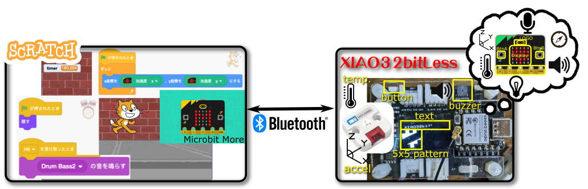

# XIAO32bitLess

Microbit More compatible environment for Seeed Studio XIAO ESP32C3.

## What is XIAO32bitLess
XIAO32bitLess is an arduino program for connecting scratch and XIAO families.
XIAO act as a Microbit More's micro:bit, so you can play with Scratch and XIAO.

## Requirement
- Supported board.
  - Seeed Studio XIAO ESP32C3 https://wiki.seeedstudio.com/XIAO_ESP32C3_Getting_Started/
  - Wio Terminal https://wiki.seeedstudio.com/Wio-Terminal-Getting-Started/
  - Seeed Studio XIAO nRF52840 (Sense) https://wiki.seeedstudio.com/XIAO_BLE/
     - Support Internal IMU at Sense.
- (Optional) Seeed Studio XIAO Expansion board for XIAO series https://wiki.seeedstudio.com/Seeeduino-XIAO-Expansion-Board/
  - You can use OLED(5x5 LED, text), Button, and Buzzer. 
- (Optional) IMU MPU6886 https://shop.m5stack.com/products/6-axis-imu-unitmpu6886

## How to use
- Compile and upload XIAO32bitLess.ino.
- Connect XIAO from Microbit More on Scratch using BLE.
- Let's play!!

### For XIAO nRF52840 Sense user
You must use a modified version of the IMU driver LSM6DS3.cpp.
- Get LSM6DS3.cpp and LSM6DS3.h, and place them in the same directory as XIAO32bitLess.ino.
- Replace Wire to Wire1.

See more detail is [XIAO BLE SENSE cannot communicate with IMU sensor](https://forum.seeedstudio.com/t/xiao-ble-sense-cannot-communicate-with-imu-sensor/265629/12).

## References
- Microbit More: https://microbit-more.github.io/
- M5bitLess: https://github.com/610t/M5bit-less and https://protopedia.net/prototype/2395
- Stretch3: https://stretch3.github.io/
